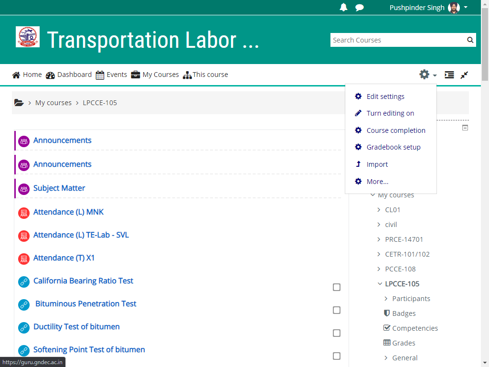
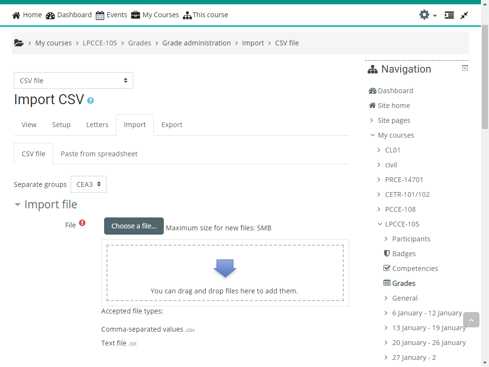
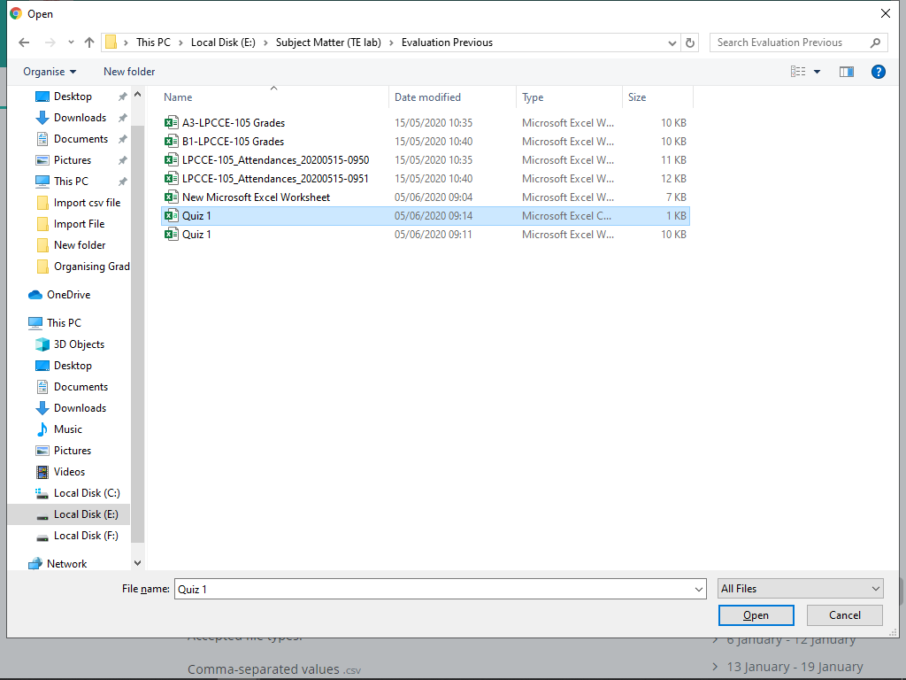
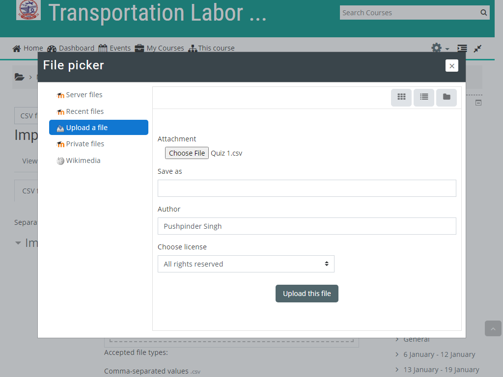
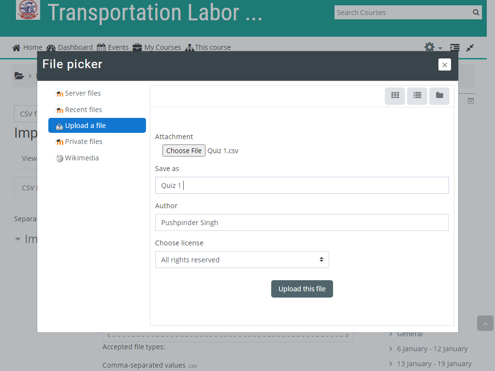
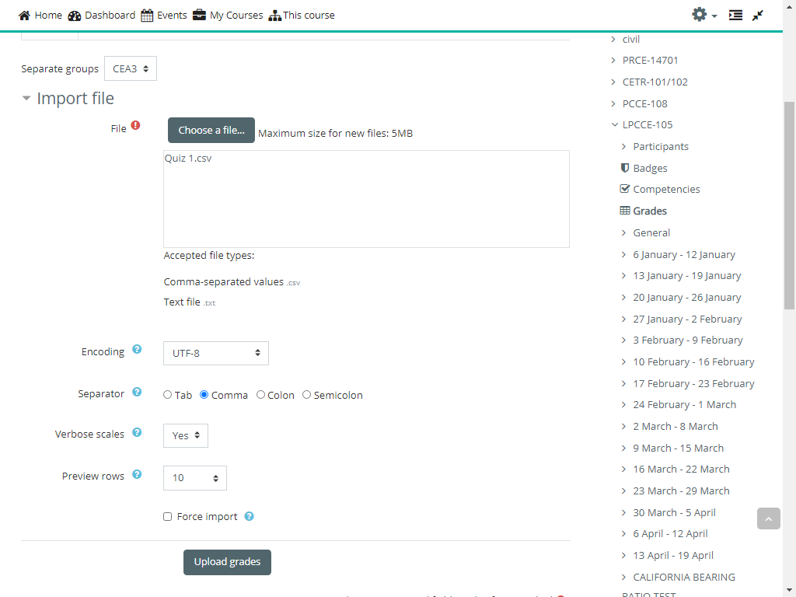
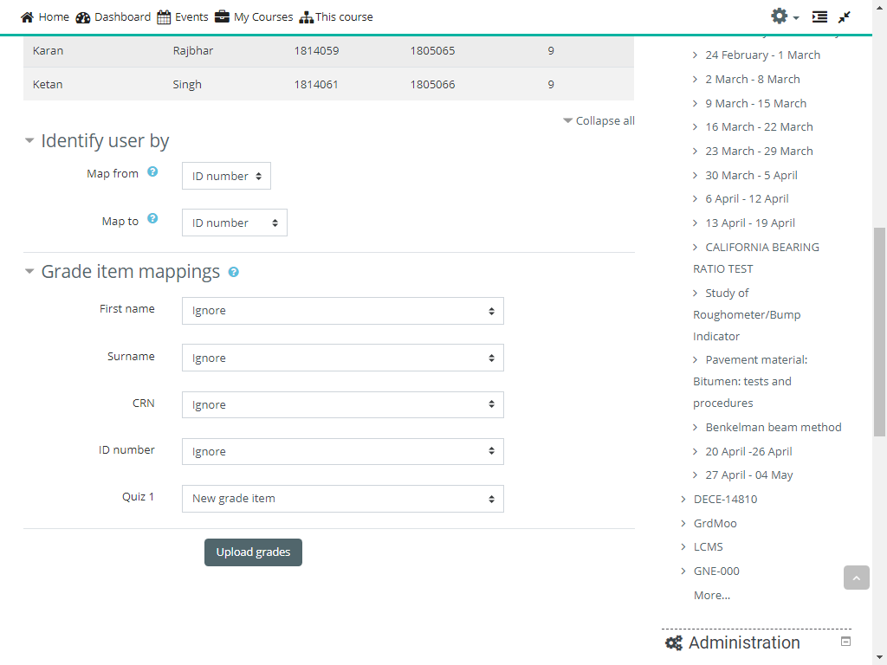
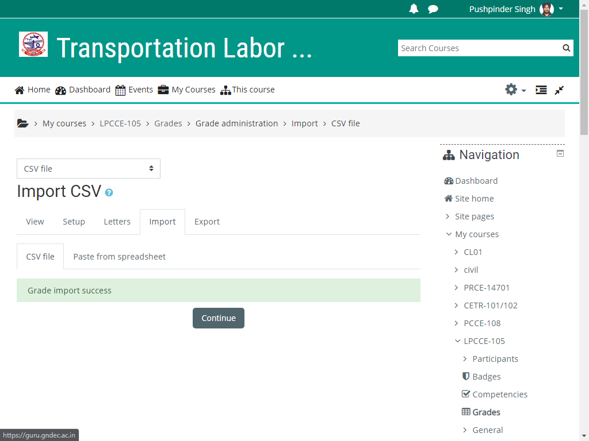
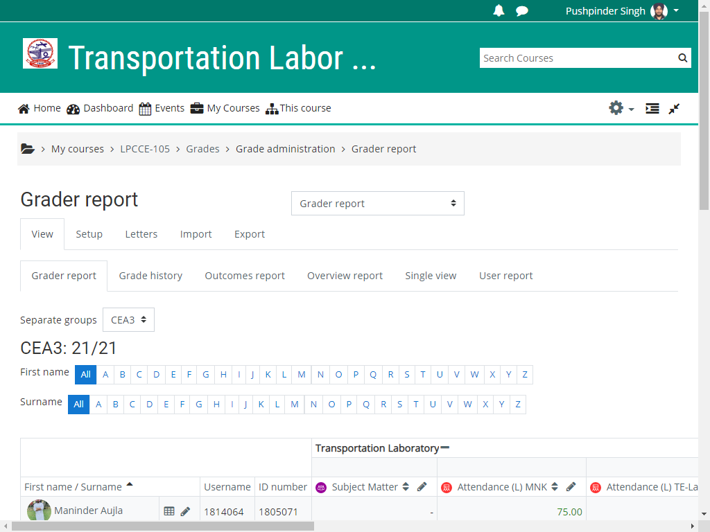

## Internal Award Calculation

We will explain the procedure to calculate Internal Assesment Awards.

We will use GradeBook of moodle.

Student will get marks on the basis of various activities like Attendacne, Assignments, Mid Semester Examinations.

We can creaet all these activities without setting up a gradebook. However it is better, if we set up grade book inadvance,

However we will follow first approach, as that will cover most common apprach adopted by a beginner.

Let us take we have a class with sections A, B and B furhther have two sub-sections B1 and B2.

### Attendacne

write here

### Assignments

abc

### Mid Semester Examinations (MSE)

xyz

